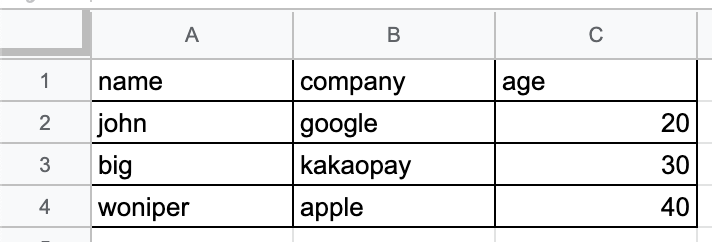

## example


위와 같은 excel sheet를 object로 매핑하는 예제를 설명한다.

### extends AbstractRow
```
@Getter
private class EmployeeRow extends AbstractRow {
	private String name;
	private String company;
	private int age;

	public EmployeeRow(Row row) {
	    super(row);
	    this.name = row.getCell(0).getStringCellValue();
	    this.company = row.getCell(1).getStringCellValue();
	    this.age = (int)row.getCell(2).getNumericCellValue();
	}
}

@Test
public void testMapping() {
    // given
    ExcelObjectMapper<EmployeeRow> parser = new RowExcelObjectMapper<>(new ResourcesExcelResource());

    // when
    List<EmployeeRow> employeeRows = parser.parse("employee.xlsx", 1, EmployeeRow.class);

    // then
    assertThat(employeeRows).hasSize(3);
    assertThat(employeeRows.get(0).getName()).isEqualTo("john");
    assertThat(employeeRows.get(0).getCompany()).isEqualTo("google");
    assertThat(employeeRows.get(0).getAge()).isEqualTo(20);
}
```


### @CellIndex with Primitive Type
```
@Getter
public class EmployeeRow {
	
    @CellIndex(index = 0)
    private String name;
	
    @CellIndex(index = 1)
    private String company;
	
    @CellIndex(index = 2)
    private int age;
}

@Test
public void testMapping() {
    // given
    ExcelObjectMapper<EmployeeRow> parser = new AnnotationExcelObjectMapper<>(new ResourcesExcelResource());

    // when
    List<EmployeeRow> employeeRows = parser.parse("employee.xlsx", 1, EmployeeRow.class);

    // then
    assertThat(employeeRows).hasSize(3);
    assertThat(employeeRows.get(0).getName()).isEqualTo("john");
    assertThat(employeeRows.get(0).getCompany()).isEqualTo("google");
    assertThat(employeeRows.get(0).getAge()).isEqualTo(20);
}
```

### @CellIndex with RowCell Type
```
@Getter
public class EmployeeRow {
    @CellIndex(index = 0)
    private RowCell<String> name;

    @CellIndex(index = 1)
    private RowCell<String> company;

    @CellIndex(index = 2)
    private RowCell<Integer> age;
}

@Test
public void testMapping() {
    // given
    ExcelObjectMapper<EmployeeRow> parser = new AnnotationExcelObjectMapper<>(new ResourcesExcelResource());

    // when
    List<EmployeeRow> employeeRows = parser.parse("employee.xlsx", 1, EmployeeRow.class);

    // then
    assertThat(employeeRows).hasSize(3);
    assertThat(employeeRows.get(0).getName().getValue()).isEqualTo("john");
    assertThat(employeeRows.get(0).getCompany().getValue()).isEqualTo("google");
    assertThat(employeeRows.get(0).getAge().getValue()).isEqualTo(20);
}
```